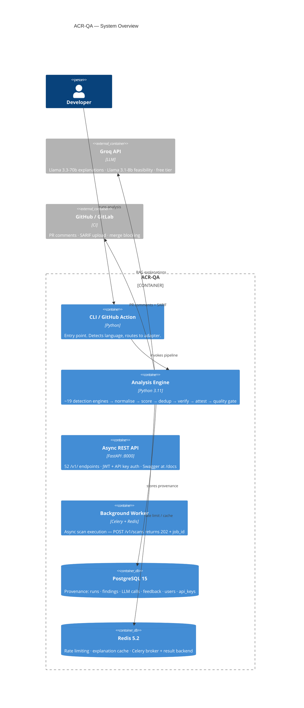

<div align="center">

# ACR-QA
### The Trust Layer for AI-Written Code

*Auto-block merges you can trust — every Confirmed finding is exploit-verified and cryptographically attested.*

[](https://github.com/ahmed-145/ACR-QA/actions/workflows/tests.yml)
[](./docs/evaluation/CONFIRMED_TIER.md)
[-22c55e)](./docs/evaluation/CVE_RECALL.md)
[](./docs/evaluation/HEAD_TO_HEAD_BENCHMARK.md)
[](https://slsa.dev/)
[](./.github/workflows/sign-images.yml)
[](./.github/workflows/self-scan.yml)
[](./TESTS/)
[](./TESTS/)
[](LICENSE)
[](https://www.python.org/)

[](https://codespaces.new/ahmed-145/ACR-QA?quickstart=1)

</div>

---

> **One line:** ACR-QA turns a noisy pile of scanner output into a small set of findings it can
> *prove* are real — by firing a live exploit in a sandbox and signing the result — so you can
> auto-block merges on **96.4%-precision, 100%-CVE-recall** evidence instead of guesses.

## The Problem

Traditional SAST tools produce **30–70% false positives**. Developers stop reading them; real
vulnerabilities hide in the noise. AI-generated code makes it worse — it introduces **1.88× more
flaws** than human code, and mean vulns-per-codebase jumped **107% YoY** in 2026.

So AppSec teams *can't* auto-block merges — they don't trust their own tooling. And auditors get
evidence that a scan "ran," not that it found anything real.

## The Answer

ACR-QA is the **trust layer**. It sits on top of your scanners (or runs standalone) and answers the
only question that matters at merge time: *is this finding real enough to block automatically?*

```
1,942 raw findings   →   30–70% are noise (industry baseline)
  219 security-tier  →   filtered by canonical rule set
  151 + taint gate   →   only findings with HTTP-source confirmation
   55 Confirmed Tier →   96.4% precision · 100% CVE recall · exploit-verified
```

The **55 Confirmed findings** are the product: turn them on as a required GitHub status check. The
other ~1,887 stay visible, searchable, and fixable — they just don't block your merge.

## The Proof — three reasons to trust it

**1. Exploit verification — "we don't report it unless we can show it firing."**
For every Confirmed finding, ACR-QA spins up an ephemeral Docker sandbox and fires a real payload:

| Finding | Payload | Result |
|---------|---------|--------|
| SQL injection | `' OR 1=1 --` | Leaked rows confirmed |
| Command injection | `; echo EXPLOITED` | Blind exec confirmed |
| SSTI (Jinja2) | `{{7*7}}` | Response contains `49` |

Verdict is three-tier: `verified-exploitable` · `verified-unexploitable` · `unverified`. Only
`verified-exploitable` enters the Confirmed Tier by default. 13 exploit categories supported.

**2. Cryptographic attestation — "you can prove this review happened."**
Every scan verdict is **ECDSA-P256 signed**, logged to **Sigstore Rekor**, and ships **SLSA L3
provenance** (plus a post-quantum CRYSTALS-Dilithium3 = FIPS-204 signature). One command verifies:

```bash
cosign verify-attestation --type custom ghcr.io/ahmed-145/acrqa:latest
# → resolves on Rekor, shows signed finding count + timestamp
```

**3. The Confirmed Tier — "96.4% of what we surface is real."** Four orthogonal gates, all must pass:

| Gate | What it checks |
|------|---------------|
| **Severity** | `HIGH` only |
| **Rule set** | 22 curated rules with empirically ≥80% precision |
| **Production code** | Excludes tests, migrations, docs, vendor |
| **Tool confidence** | For Bandit: `issue_confidence == HIGH` (an *external*, non-tautological signal) |

Conservative precision **96.4%** (95% CI [90.9%, 100%]) · F1 = **98.2%** vs Bandit 21.8% / Semgrep 45.7%.

---

## Competitive Position

Exploit-verified remediation became the 2026 vanguard. ACR-QA independently converges on the same
paradigm for **first-party application source, in CI, ECDSA-attested, at $0** — the one quadrant the
named vanguard (all closed or paid) doesn't occupy.

| Tool | Re-exploits to verify fix | Layer | Notes |
|---|:---:|---|---|
| **ACR-QA** | ✅ | First-party SAST in CI | ECDSA-signed, $0, 13 exploit categories |
| Qualys TruConfirm | ✅ | CVE / deployed-asset ETM | Re-detonates on deployed infra (Mar 2026) |
| ZeroPath | ✅ | AI-native SAST+DAST | Exploit proof + fix verification, closed source |
| Snyk / Semgrep / GHAS | ❌ | — | Static re-scan only: guesses if the fix worked |
| Checkmarx / SonarQube | ❌ | — | Static re-scan only |

| Feature | Snyk Code | Semgrep | GHAS/CodeQL | **ACR-QA** |
|--|:--:|:--:|:--:|:--:|
| Exploit verification (Docker) | ❌ | ❌ | ❌ | ✅ |
| Re-exploit to verify fix | ❌ | ❌ | ❌ | ✅ |
| Cryptographic attestation (ECDSA + Rekor) | ❌ | ❌ | ❌ | ✅ |
| SLSA L3 provenance | ❌ | ❌ | ❌ | ✅ |
| Confirmed Tier (auto-block) | ❌ | ❌ | ❌ | ✅ 96.4% |
| LLM-augmented detection | partial | ❌ | ❌ | ✅ +5.2pp, gated |
| Self-hosted / $0 recurring | ❌ | ❌ | ❌ | ✅ |
| RealVuln recall (2026 benchmark) | 17.4% F3 | 17.5% | — | **25%** full / **48%** detectable |

ACR-QA integrates *with* Semgrep and Snyk (not against them) — it adds the verification and
attestation layer their output is missing. Full pricing/positioning: [`docs/business/PRICING_POSITIONING.md`](docs/business/PRICING_POSITIONING.md).

---

## Key Numbers (v5.0.0rc2)

**Recall — three honest numbers across two corpora:**

| Number | Corpus | Meaning |
|---|---|---|
| **91.0%** | SecurityEval (single-file synthetic, n=89 detectable CWEs) | Algorithmic soundness on isolated patterns |
| **48%** | RealVuln **detectable subset** (26 real Python apps, statically-feasible CWEs) | Real multi-file apps, static-ceiling recall |
| **25.1%** | RealVuln **full corpus** (697 TPs incl. auth/CSRF/IDOR no SAST can detect) | Total honest recall |

On the **RealVuln 2026 leaderboard** (arXiv:2604.13764), ACR-QA's 25.1% beats every rule-based SAST
tool — Semgrep CE 17.5%, Snyk 17.4%, SonarQube 6.5%. Agentic LLMs (Claude Sonnet ~50%) lead; the
honest position is to name that gap and show the exploit-verification moat LLM-only tools lack.
SecurityEval Youden J = 0.157 leads Bandit 0.090 and Semgrep 0.056.

**Two operating points, one scan** — two points on the same PR curve, for different jobs:

| Operating Point | TPR | FPR | Precision | Use Case |
|---|:--:|:--:|:--:|---|
| **Full output** (recall-first) | 91.0% | 75.3% | 54.7% | Developer triage; comprehensive review |
| **Confirmed Tier** (precision-first) | ~30% | ~0% | **96.4%** | Auto-block merge gate; CI required check |

**Optional `--llm` augmentation** adds a *gated* LLM pass on top of the deterministic core — held-out
**+5.2pp recall at 89.5% precision** (LLM-alone is strictly worse; the union, after gating, wins).
Every LLM finding still flows through exploit-verification. Details: [`docs/evaluation/PROTO_LLM_DETECTION.md`](docs/evaluation/PROTO_LLM_DETECTION.md).

**At a glance:** **100%** CVE recall (8/8 pre-registered) · 9/10 OWASP Top 10 · **3,017 tests** at
**88% CORE coverage** · 52 FastAPI endpoints · 327+ rule mappings · **0 critical** on self-scan ·
**Verified Remediation** (`fix_verified=True` by live re-exploit + ECDSA signature).

---

## Engine Map

The pipeline is **36 engine modules across 7 orthogonal layers**. Of these, the **~19 detection
engines** (language adapters + core analysis) are what produce findings; the rest verify, attest,
explain, and prioritise. Every engine writes only `CanonicalFinding` objects, so adding one never
breaks another.

| Layer | Count | Engines | On by default? |
|-------|------:|---------|:----------:|
| **Language Adapters** (run tools via subprocess) | 10 | ruff · bandit · semgrep · vulture · radon · jscpd (Py); ESLint · semgrep-js (JS/TS); gosec · staticcheck (Go) | ✅ |
| **Core Pipeline** (normalise → score → gate) | 6 | `normalizer` · `severity_scorer` · `fingerprint` · `taint_analyzer` · `quality_gate` · `confirmed_tier` | ✅ |
| **Trust & Verification** | 4 | `exploit_verifier` (Docker, 13 categories) · `verified_remediation` · `attestation` (ECDSA + Rekor) · `confidence_scorer` | ✅ per finding |
| **AI Augmentation** (optional) | 9 | `explainer` · `llm_detector` · `ai_code_detector` · `ai_code_diff` · `path_feasibility` · `second_opinion` · `triage_agent` · `triage_memory` · `ollama_provider` | `--llm` flag |
| **Supply Chain & SCA** | 6 | `sca_scanner` · `osv_offline` · `trivy_adapter` · `trufflehog_adapter` · `supply_chain` · `cbom_scanner` | ✅ |
| **Smart Triage & Risk** | 6 | `risk_predictor` · `pr_risk` · `review_bottleneck` · `learned_suppression` · `autofix` · `time_travel` | ✅ |
| **Cross-Cutting Analysis** | 4 | `reachability` · `dependency_reachability` · `cross_language_correlator` · `iac_scanner` | ✅ |

---

## Architecture



> Full C4 model: [C1 Context](docs/architecture/c1-context.md) · [C2 Containers](docs/architecture/c2-containers.md) · [C3 Components](docs/architecture/c3-components.md) · [C4 Code](docs/architecture/c4-code.md)

---

## Quick Start

**A — GHCR (one line, no clone):**
```bash
docker run --rm -v $(pwd):/scan -e GROQ_API_KEY_1=your_key \
  ghcr.io/ahmed-145/acrqa:latest python3 CORE/main.py --target-dir /scan --rich
```

**B — Docker Compose (full stack):**
```bash
git clone https://github.com/ahmed-145/ACR-QA.git && cd ACR-QA
cp .env.example .env          # add your GROQ_API_KEY_1..4
docker compose up -d          # FastAPI :8000/docs · Grafana :3005 · Prometheus :9091
```

**C — GitHub Codespaces:** click the badge above (devcontainer installs all tools, ~2 min).

**D — Local:**
```bash
pip install -r requirements.txt
createdb acrqa && psql -d acrqa -f DATABASE/schema.sql
cp .env.example .env && source .env
uvicorn FRONTEND.api.main:app --port 8000    # → http://localhost:8000/docs
```

**Run your first analysis:**
```bash
python3 CORE/main.py --target-dir ./myproject --rich          # Python, rich output
python3 CORE/main.py --target-dir ./my-express-app --lang javascript --no-ai
python3 CORE/main.py --target-dir ./my-go-api --lang go
python3 CORE/main.py --target-dir . --json --no-ai > findings.json   # CI-friendly
```

Key flags: `--diff-only` (changed files only) · `--auto-fix` · `--pr-number N` (post PR comment) ·
`--llm` (gated LLM pass) · `--no-ai` (no API key needed) · `--version`. Full CLI + the `.acrqa.yml`
policy reference: [`docs/POLICY_ENGINE.md`](docs/POLICY_ENGINE.md).

---

## How It Works

**Detection pipeline.** ~19 detection engines run in parallel; every output is normalised into one
`CanonicalFinding` schema (severity, canonical rule ID, file, line, fingerprint, evidence), then
deduplicated, scored, taint-gated, exploit-verified, and quality-gated.

| Tool | Language | Catches |
|------|----------|---------|
| Ruff · Bandit · Semgrep · Vulture · Radon | Python | style, security anti-patterns, OWASP patterns, dead code, complexity |
| Secrets Detector · SCA · CBoM | All / Python | leaked credentials, vulnerable deps, crypto misuse |
| ESLint · Semgrep-JS · npm audit | JS / TS | security plugin (20 rules), 56 mappings |
| gosec · staticcheck · Semgrep-Go | Go | Go vulns + static analysis, 45+ mappings |

**AI explanation (RAG-grounded, optional).** A 66-rule knowledge base grounds every LLM
explanation; the model is given the rule text and cannot invent advice it can't cite. Three runs
with varying temperature feed an N-gram-entropy consistency score; a second call (LLM4PFA) checks
whether a HIGH finding's path is reachable in production.

**Quality gate (`.acrqa.yml`).** `mode: block` fails CI (exit 1) and blocks the merge; per-repo rule
disables, severity overrides, ignore-paths, and inline `# acr-qa:ignore` suppression are supported.

```yaml
quality_gate: { mode: block, max_high: 0, max_medium: 5, max_security: 0 }
```

**Dashboard** (`http://localhost:8000/docs` + static UI at `/ui/`): severity counters, finding cards
with AI explanations + confidence badges, trend charts, 👍/👎 false-positive feedback feeding triage
memory, and SARIF / provenance / Markdown export.

---

## CI/CD Integration

```yaml
# .github/workflows/acr-qa.yml (already in repo) — on every PR:
#  1. Runs detection engines on changed files (--diff-only)
#  2. Normalises, scores, generates AI explanations
#  3. Posts a severity-sorted PR comment with code suggestions
#  4. Uploads findings.sarif to the GitHub Security tab
#  5. Fails the merge if the quality gate is violated (exit 1)
```

Secrets: `GROQ_API_KEY_1..4` · `GITHUB_TOKEN` (auto). Comment `acr-qa review` to trigger manually.
GitLab CI (`.gitlab-ci.yml`) included. Prometheus scrapes `/metrics`; Grafana dashboard at `:3005`.

---

## Evaluation

**Layer A — ground truth (836 findings, 97.1% overall / 100% security-class precision):**

| Repository | Findings | Precision | Security Precision | Recall |
|------------|:--:|:--:|:--:|:--:|
| DVPWA | 44 | 81.8% | 100% | 50% |
| Pygoat | 440 | 96.4% | 100% | 100% |
| VulPy | 293 | 100% | 100% | 100% |
| DSVW | 59 | 100% | 100% | 100% |
| **Overall** | **836** | **97.1%** | **100%** | — |

**Layer B — 30-repo adversarial precision corpus** (top-20 PyPI + top-6 npm + top-4 Go): Confirmed
Tier **96.4% / 100%**, F1 98.2%. Plus a **six-track novel battery (X1–X6)**: live-CVE holdout,
Docker-sandbox exploit verification, AI-generated-code study (8–12× human baseline), time-travel
backtest, LLM-augmented detection, and a pre-registered robustness study (0.0% HIGH FPR on 7 mature
PyPI packages). Full provenance index: **[`docs/evaluation/README.md`](docs/evaluation/README.md)**.

**Research questions:** RQ1 RAG hallucination reduction · RQ2 PostgreSQL provenance · RQ3 label-free
confidence scoring · RQ4 precision/recall vs commercial SAST — see [`docs/evaluation/README.md`](docs/evaluation/README.md).

**Tests:** 3,017 (2,954 Python + 63 TS) at 88% CORE coverage — `make test-all` or
`.venv/bin/pytest TESTS/ -v`.

---

## Documentation

Start at the **[docs index](docs/README.md)**. Highlights:

| Doc | What |
|-----|------|
| [Architecture (C1–C4)](docs/architecture/) · [ADRs](docs/adr/) | System model + why each major choice was made |
| [Evaluation index](docs/evaluation/README.md) | Every headline number's provenance |
| [API Reference](docs/API_REFERENCE.md) | The 52 REST endpoints under `/v1/` |
| [Policy Engine](docs/POLICY_ENGINE.md) | `.acrqa.yml` full reference |
| [Pricing & Positioning](docs/business/PRICING_POSITIONING.md) · [Unit Economics](docs/business/UNIT_ECONOMICS.md) | Open-core model + TAM |
| [Defense Q&A](docs/QA_PREP.md) · [Changelog](docs/CHANGELOG.md) | Rehearsal cards + version history |

**Architecture Decision Records** ([`docs/adr/`](docs/adr/)): 0001 scope · 0002 multi-tool adapter ·
0003 RAG over generic LLM · 0004 Groq provider · 0005 Postgres provenance ·
[0006 detection-engine architecture](docs/adr/0006-detection-engine-architecture.md) ·
[0007 Confirmed Tier gates](docs/adr/0007-confirmed-tier-gates.md) · 0008 exploit-verification
sandbox · 0009 taint design · 0010 benchmark methodology · 0011 verified remediation · 0012 language
adapter ABC · 0013 CanonicalFinding data-flow contract.

**Interactive demos** ([Marimo](https://marimo.io)): `notebooks/walkthrough.py` (full pipeline) +
`notebooks/engine_demos/` (taint · exploit · attestation · offline). Run with `marimo run <file>`.

---

## Technology Stack

Python 3.11+ · FastAPI 0.115 (async) · React 18 + TypeScript + Vite 5 + shadcn/ui · PostgreSQL 15 ·
Redis 7 · Groq Llama 3.3-70b (explanations) / 3.1-8b (feasibility) · Ruff · Semgrep · Bandit ·
Vulture · Radon · gosec · staticcheck · ESLint · Pydantic v2 · Docker Compose · Prometheus + Grafana ·
GitHub Actions + GitLab CI · SARIF v2.1.0 / Markdown / JSON export.

---

## Academic Context

| | |
|-|-|
| **Student** | Ahmed Mahmoud Abbas |
| **Supervisor** | Dr. Samy AbdelNabi |
| **Institution** | King Salman International University (KSIU) |
| **Timeline** | October 2025 – June 2026 |
| **Status** | v5.0.0rc2 · P4 Confirmed Tier 96.4% / F1 98.2% · SLSA L3 · X1–X6 battery complete |

**Remaining (Ahmed-led):** record the demo video ([script](docs/business/DEMO_VIDEO_SCRIPT.md)) →
YouTube → HN/LinkedIn post ([drafts](docs/business/LAUNCH_POSTS.md), after defense). Shipped: GHCR
image (Cosign-signed, SLSA L3), Codespaces, Cloudflare Pages demo, κ study materials.

---

## License

MIT — see [LICENSE](LICENSE).

<div align="center">

Built with ❤️ at King Salman International University · [⭐ Star this repo](https://github.com/ahmed-145/acr-qa)

</div>
