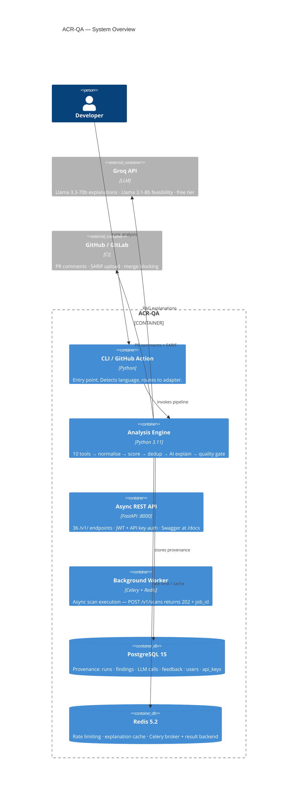

<div align="center">

# 🛡️ ACR-QA
### Automated Code Review & Quality Assurance Platform

*10 static analysis tools. One canonical schema. RAG-enhanced AI explanations. $0 recurring cost.*

[](https://www.python.org/)
[](docs/CHANGELOG.md)
[](https://acrqa-api-production.up.railway.app/health)
[](./TESTS/)
[](./htmlcov/)
[](./docs/evaluation/PER_TOOL_EVALUATION.md)
[](./docs/evaluation/EVALUATION.md)
[](./CORE/adapters/)
[](./FRONTEND/api/)
[](LICENSE)
[](https://github.com/ahmed-145/ACR-QA/actions/workflows/tests.yml)
[](./dashboard/e2e/accessibility.spec.ts)
[](./dashboard/src/locales/)
[](./deploy/helm/acrqa/)
[](./deploy/terraform/aws/)
[](./FRONTEND/api/main.py)
[](./.github/workflows/sign-images.yml)
[](https://slsa.dev/)
[](./docs/setup/UPTIMEROBOT_SETUP.md)

</div>

---

## What It Is

ACR-QA is a **provenance-first, AI-augmented code review platform** built as a graduation thesis at KSIU. It solves three real problems that frustrate every developer using static analysis tools:

| Problem | What ACR-QA does |
|---|---|
| **Alert fatigue** — 7 tools dump raw JSON in incompatible schemas, full of duplicates | Normalises all output into one canonical schema, deduplicates cross-tool, ranks by severity |
| **LLM hallucination** — AI assistants give confident but wrong security advice | RAG: the LLM can only explain rules it can cite from a curated 66-rule knowledge base; semantic entropy (3× runs) detects contradictions |
| **Invisible test gaps** — code coverage % doesn't tell you *which* complex functions have no test | AST-based Test Gap Analyzer ranks untested symbols by cyclomatic complexity |

**Key numbers:** 97.1% precision · 9/10 OWASP Top 10 · **2,757 tests** (2,653 Python + 104 TypeScript) · 52 async API endpoints · 18 Alembic migrations · 327+ rule mappings (incl. 28 IaC) · **100% recall vs Semgrep CE 71.2% (+28.8pp)** (13-repo head-to-head) · $0 recurring cost

---

## Architecture



> Full C4 diagrams: [C1 Context](docs/architecture/c1-context.md) · [C2 Containers](docs/architecture/c2-containers.md) · [C3 Components](docs/architecture/c3-components.md) · [C4 Code](docs/architecture/c4-code.md)

---

## Quick Start

### Option A — Docker (one command)

```bash
git clone https://github.com/ahmed-145/acr-qa.git && cd acr-qa
cp .env.example .env          # add your GROQ_API_KEY_1..4
make up
```

| Service | URL |
|---------|-----|
| FastAPI | http://localhost:8000 |
| Grafana | http://localhost:3005 (admin/admin) |
| Prometheus | http://localhost:9091 |

### Option B — Local

```bash
pip install -r requirements.txt
createdb acrqa && psql -d acrqa -f DATABASE/schema.sql
cp .env.example .env && source .env
uvicorn FRONTEND.api.main:app --port 8000    # → http://localhost:8000/docs
```

### Run your first analysis

```bash
# Python project
python3 CORE/main.py --target-dir ./myproject --rich

# JavaScript / TypeScript project
python3 CORE/main.py --target-dir ./my-express-app --lang javascript --no-ai

# Go project
python3 CORE/main.py --target-dir ./my-go-api --lang go

# JSON output for CI pipelines
python3 CORE/main.py --target-dir . --json --no-ai > findings.json
```

---

## What's New in v5.0.0-beta (in progress)

Phase A of the v5.0.0 push (see [`docs/GOD_MODE_V3_PLAN.md`](docs/GOD_MODE_V3_PLAN.md)) is in flight.
Week A1 (UI Killshot) and Week A2 (new engines) are shipped on `main`:

| Feature | Module / Component | Shipped |
|---|---|---|
| **AI Chat Sidebar** per finding (SSE-streamed Groq replies, 4 preset prompts) | `FRONTEND/api/routers/findings.py` + `dashboard/.../ChatSidebar.tsx` | ✅ A1.1–2 |
| **Visual Call Graph** (pure-SVG layered layout, react-flow not needed) | `dashboard/.../CallGraph.tsx` | ✅ A1.3 |
| **Risk Heatmap of File Tree** (HIGH-density coloring, top-3 rules tooltip) | `dashboard/.../RiskHeatmap.tsx` | ✅ A1.4 |
| **Vulnerability Timeline** (Gantt-style per-rule presence across 30 runs) | `dashboard/.../VulnerabilityTimeline.tsx` | ✅ A1.5 |
| **IaC Scanner** (28 canonical rules: Terraform / K8s / Dockerfile) | `CORE/engines/iac_scanner.py` | ✅ A2.1 |
| **Time-Travel Vulnerability Analyzer** (`git log -L`, bounded 50 commits) | `CORE/engines/time_travel.py` + `FindingHistory.tsx` | ✅ A2.2 |
| **Heuristic Risk Predictor** (transparent 6-feature linear model — explicitly *not* ML) | `CORE/engines/risk_predictor.py` | ✅ A3.1 |
| **Eval Wave 1+2** (20-CVE pre-registered recall battery; benchmark harness; `run_benchmarks.py`) | `TESTS/evaluation/ground_truth/` | ✅ A3.4 + A4.3 |
| **Subprocess sandbox audit** (AST-based; caught + fixed 3 real `shell=True` in our own scripts) | `TESTS/test_subprocess_safety.py` | ✅ A4.1 |
| **Dogfood gate** (IaC + bandit on ourselves; HIGH=0 enforced) | `scripts/dogfood.py` | ✅ A4.1 |
| **Peer-rating κ harness** (hand-implemented Cohen's + Fleiss' κ; no scipy) | `scripts/peer_rating.py` | ✅ A4.2 |
| **Head-to-head Semgrep CE methodology** (pre-registered scoring rules) | `docs/evaluation/HEAD_TO_HEAD_SEMGREP.md` | ✅ A4.4 |
| **Thesis paper sections 1–3** (IEEE template + 11-cite bib) | `paper/acrqa_thesis.tex` | ✅ A4.5 |
| **PR Risk Score** (0–100 per-PR signal: reachability + taint + exploit + size + file-risk) | `CORE/engines/pr_risk.py` · `GET /v1/runs/{id}/pr-risk` | ✅ A5 |
| **Second Opinion Engine** (Groq Llama-3.3-70B + Ollama local; +15/−10 confidence delta) | `CORE/engines/second_opinion.py` · `POST /v1/findings/{id}/second-opinion` | ✅ A5 |
| **PR Preview Sandbox** (static/docker/full; designed for GitHub Action PR comment) | `scripts/pr_sandbox.py` | ✅ A5 |
| **Per-user Groq quota** (100K tokens/day default; `GET /v1/users/me/quota`) | `DATABASE/database.py` · migration 0018 | ✅ A5 |
| **GDPR account deletion** (`DELETE /v1/auth/users/me` cascade) | `FRONTEND/api/routers/auth.py` | ✅ A5 |
| **Public demo endpoint** (`GET /v1/demo/dsvw`) | `FRONTEND/api/main.py` | ✅ A5 |
| **Review Bottleneck Analyzer** (Gini load, review latency, stale PRs, % no-comment — pure git log) | `CORE/engines/review_bottleneck.py` · `GET /v1/runs/{id}/review-bottleneck` | ✅ A5.5 |

Engine docs: [`docs/engines/iac_scanner.md`](docs/engines/iac_scanner.md) · [`docs/engines/time_travel.md`](docs/engines/time_travel.md) · [`docs/engines/risk_predictor.md`](docs/engines/risk_predictor.md)

**Phase A complete.** All 5 code weeks shipped on `main`. Week A6 = defense polish only (slides, Q&A prep, rehearsal — no new code).

---

## What Makes It Different

| Feature | CodeRabbit | SonarQube | **ACR-QA** |
|---------|:----------:|:---------:|:----------:|
| Multi-tool normalisation | ✅ | ✅ | ✅ 10 tools |
| AI explanations | ✅ | ✅ | ✅ RAG + entropy |
| **Hallucination detection** | ❌ | ❌ | ✅ semantic entropy (3×) |
| **Test gap analysis** | ❌ | ❌ | ✅ AST-based |
| **Confidence per finding** | ❌ | ❌ | ✅ 0–100 score |
| **Feedback-driven tuning** | ❌ | ❌ | ✅ auto suppression |
| **Cost-benefit analysis** | ❌ | ❌ | ✅ ROI per finding |
| **Call-graph reachability** | ❌ | ❌ | ✅ AST-based, 0% FP rate |
| **Path feasibility (FP reduction)** | ❌ | ❌ | ✅ LLM4PFA approach |
| **Cross-language vuln chains** | ❌ | ❌ | ✅ CHARON-inspired |
| **CBoM (quantum-safety)** | ❌ | ❌ | ✅ NIST FIPS 203/204 |
| Quality gates (CI blocking) | ✅ | ✅ | ✅ configurable |
| SARIF export | ✅ | ✅ | ✅ v2.1.0 |
| OWASP compliance report | ✅ | ✅ | ✅ 9/10 + CWE IDs |
| Recurring cost | $$$ | $$$ | **$0** |

---

## Features

### Detection Pipeline

10 tools run in parallel, all output normalised into one `CanonicalFinding` schema:

| Tool | Language | What It Catches |
|------|----------|----------------|
| **Ruff** | Python | Style, imports, unused code, PEP8 |
| **Bandit** | Python | Security anti-patterns (33 rules) |
| **Semgrep** | Python / JS / Go | OWASP Top 10 patterns, custom rules |
| **Vulture** | Python | Dead code, unreachable branches |
| **Radon** | Python | Cyclomatic complexity, maintainability |
| **Secrets Detector** | All | API keys, passwords, JWTs, tokens |
| **SCA Scanner** | Python | Known-vulnerable dependency versions |
| **ESLint** | JS / TS | Security plugin — 20 rules |
| **gosec** | Go | Go security vulnerabilities |
| **staticcheck** | Go | Go static analysis and bug detection |

### AI Explanation (RAG-Enhanced)

- **66-rule knowledge base** (`config/rules.yml`) — every rule has description, rationale, remediation, and code examples
- **Evidence-grounded prompts** — the LLM is given the rule text; it cannot invent advice for rules it can't cite
- **Semantic entropy** — 3× LLM runs with varying temperature; contradictions lower the confidence score
- **Self-evaluation** — LLM rates its own output 1–5 on relevance/accuracy/clarity
- **Path feasibility** (Feature 7) — second AI call validates whether a HIGH finding's code path is actually reachable in production (LLM4PFA approach)

### Quality Gate

```yaml
# .acrqa.yml
quality_gate:
  mode: block         # block = fail CI + prevent merge | warn = comment only
  max_high: 0         # zero tolerance for HIGH severity
  max_medium: 5
  max_security: 0
```

Fails CI with exit code 1. GitHub Action posts severity table as PR comment.

### Per-Repo Policy (`.acrqa.yml`)

```yaml
rules:
  disabled_rules: [IMPORT-001, STYLE-007]
  severity_overrides: {COMPLEXITY-001: low}

analysis:
  ignore_paths: [.venv, migrations/, node_modules]

ai:
  max_explanations: 50
  model: llama-3.1-8b-instant
```

### Inline Suppression

```python
result = eval(user_input)      # acr-qa:ignore
password = "secret123"         # acrqa:disable SECURITY-005
```

### FastAPI Dashboard (http://localhost:8000/docs)

- Severity counters with live counts
- Finding cards with collapsible AI explanations + 🎯 confidence badge
- Cost-benefit widget: analysis cost, hours saved, ROI ratio
- Trend charts across last 30 runs
- False-positive feedback (👍/👎) — feeds triage memory for future suppression
- Filters by severity, category, rule ID, full-text search
- Export: SARIF, provenance trace, Markdown reports

---

## CLI Reference

```bash
python3 CORE/main.py [options]

  --target-dir DIR     Directory to analyse (default: samples/realistic-issues)
  --repo-name NAME     Repository name for provenance tracking
  --pr-number N        PR number (enables GitHub PR comment posting)
  --limit N            Max findings to AI-explain (default: 50)
  --diff-only          Analyse only files changed in git diff
  --diff-base BRANCH   Base branch for diff (default: main)
  --auto-fix           Generate auto-fix suggestions for fixable rules
  --rich               Rich terminal output with colour-coded tables
  --lang LANG          auto (default) | python | javascript | typescript | go
  --no-ai              Skip AI explanation step (faster, no API key needed)
  --json               Output findings as JSON to stdout (pipe-friendly)
  --version            Print version and exit
```

---

## Language Support

### Python (v1.0+)
Ruff · Bandit · Semgrep · Vulture · Radon · Secrets · SCA · CBoM

### JavaScript / TypeScript (v3.0.1+)

```bash
python3 CORE/main.py --target-dir ./my-react-app          # auto-detect
python3 CORE/main.py --target-dir ./my-express-api --lang javascript
```

ESLint (security plugin) · Semgrep JS rules · npm audit
56 rule mappings · 15 HIGH-severity security rules covered

### Go (v3.2.0+)

```bash
python3 CORE/main.py --target-dir ./my-go-api --lang go
```

Prerequisites: `go install github.com/securego/gosec/v2/cmd/gosec@latest && go install honnef.co/go/tools/cmd/staticcheck@latest`

gosec · staticcheck · Semgrep Go rules · 45+ rule mappings

---

## CI/CD Integration

### GitHub Actions

```yaml
# .github/workflows/acr-qa.yml (already in repo)
# Triggers on every PR:
# 1. Runs all 10 tools on changed files (--diff-only)
# 2. Normalises, scores, generates AI explanations
# 3. Posts severity-sorted PR comment with code suggestions
# 4. Uploads findings.sarif to GitHub Security Tab
# 5. Fails merge if quality gate violated (exit code 1)
```

**Required secrets:** `GROQ_API_KEY_1..4` · `GITHUB_TOKEN` (auto-provided)

### Manual trigger on PR

Comment on any PR:
```
acr-qa review
```

### GitLab CI
`.gitlab-ci.yml` included. Set `GROQ_API_KEY_1` and `GITLAB_TOKEN` in CI/CD Variables.

---

## Monitoring

Prometheus scrapes `/metrics` every 15 s. Grafana dashboard at **http://localhost:3005** (admin/admin):

| Panel | Metric |
|-------|--------|
| Request Rate | `rate(acrqa_http_requests_total[5m])` |
| P95 Latency | `histogram_quantile(0.95, ...)` |
| HTTP Success Rate | `2xx / total * 100` |
| LLM Latency | `avg(explain endpoint duration)` |
| Error Rate | `rate(5xx[1m])` |

---

## Testing

```bash
make test-all          # 2,629 tests (full suite)
make test              # acceptance tests only
make run               # pipeline on sample files
```

| Test File | Tests | Coverage |
|-----------|------:|----------|
| `test_acceptance.py` | 4 | Pipeline E2E with mocked LLM |
| `test_api.py` | 9 | FastAPI endpoints |
| `test_normalizer.py` | 7 | Ruff / Bandit / Semgrep normalisation |
| `test_new_engines.py` | 117 | Secrets, SCA, CBoM, autofix, quality gate, KeyPool |
| `test_deep_coverage.py` | 100 | 12-module deep coverage |
| `test_god_mode.py` | 96 | All features + regression + edge cases |
| `test_js_adapter.py` | 63 | JS/TS adapter, E2E pipeline, CLI routing |
| `test_reachability.py` | 74 | Call-graph engine, fixtures, enrich_findings |
| `test_taint_analyzer.py` | 65+ | Inter-procedural taint, sanitizer recognition |
| `test_supply_chain.py` | 62 | Lockfile parsers, OSV CVE, risk scoring, SBOM |
| `test_attestation.py` | 60 | AttestationEngine, ECDSA-P256, Dilithium3 PQ |
| `test_exploit_verifier.py` | 59 | Docker sandbox, 3-tier verdict |
| `test_fastapi_app.py` | 32 | FastAPI TestClient — all v1 endpoints |
| `test_chaos.py` | 13 | Postgres/Redis failure injection |
| `test_week1_completion.py` | 42 | Fuzz/snapshot/perf-gate/mutation-killing |
| *(+ 31 more files)* | 1,536 | Additional coverage |
| **TypeScript (Vitest)** | 65 | Button, Badge, Card, ScanCard, FindingsTable… |

---

## Thesis Evaluation

### Research Questions

| RQ | Implementation | Metric |
|----|----------------|--------|
| **RQ1** Can RAG reduce LLM hallucination? | 66-rule KB + evidence-grounded prompts + entropy | `consistency_score` (0–1) |
| **RQ2** How to ensure provenance? | Full PostgreSQL audit trail per LLM call | `llm_explanations` table |
| **RQ3** What confidence scoring works? | score = severity × category × tool × rule × fix_validated | `confidence_score` (0–100) |
| **RQ4** Does it match industry tools? | 10-tool pipeline vs CodeRabbit / SonarQube | Feature parity table above |

### Benchmark Results (4 repositories)

| Repository | Findings | Precision | Security Precision | Recall |
|------------|:--------:|:---------:|:------------------:|:------:|
| DVPWA | 44 | 81.8% | 100% | 50% |
| Pygoat | 440 | 96.4% | 100% | 100% |
| VulPy | 293 | 100% | 100% | 100% |
| DSVW | 59 | 100% | 100% | 100% |
| **Overall** | **836** | **97.1%** | **100%** | — |

DVPWA recall 50%: 3 of 6 known vulns detected; CSRF (runtime-only), hardcoded debug mode, and one abstracted cred require DAST — documented limitation, not a bug.

---

## Architecture Decision Records

Key design decisions are documented in [`docs/adr/`](docs/adr/):

| ADR | Decision |
|-----|----------|
| [0001](docs/adr/0001-context-and-goals.md) | Scope: self-hosted thesis tool, not SaaS |
| [0002](docs/adr/0002-multi-tool-adapter-pattern.md) | LanguageAdapter pattern for multi-language support |
| [0003](docs/adr/0003-rag-over-generic-llm.md) | RAG + semantic entropy over generic LLM prompts |
| [0004](docs/adr/0004-groq-as-llm-provider.md) | Groq free tier with 4-key rotation pool |
| [0005](docs/adr/0005-postgres-for-provenance.md) | PostgreSQL for provenance storage |

---

## Technology Stack

| Layer | Technology |
|-------|-----------|
| Language | Python 3.11+ |
| Web Framework | FastAPI 0.115 (async) |
| Frontend | React 18 + TypeScript + Vite 5 + shadcn/ui |
| Database | PostgreSQL 15 |
| Cache / Rate Limiting | Redis 7 |
| AI Model | Groq Llama 3.3-70b (explanations) · Llama 3.1-8b (feasibility) |
| Static Analysis | Ruff, Semgrep, Bandit, Vulture, Radon, gosec, staticcheck, ESLint |
| Terminal UI | Rich |
| Schema Validation | Pydantic v2 |
| Containerisation | Docker + Docker Compose |
| Monitoring | Prometheus + Grafana |
| CI/CD | GitHub Actions + GitLab CI |
| Export Formats | SARIF v2.1.0, Markdown, JSON |

---

## Interactive Demo Notebooks

Run these [Marimo](https://marimo.io) notebooks locally or view the exported HTML:

| Notebook | Description | HTML Preview |
|----------|-------------|--------------|
| [`notebooks/walkthrough.py`](notebooks/walkthrough.py) | 12-cell full pipeline walkthrough | [walkthrough.html](docs/walkthrough.html) |
| [`notebooks/engine_demos/taint.py`](notebooks/engine_demos/taint.py) | Taint analyzer — source→sink data-flow | [demo_taint.html](docs/demo_taint.html) |
| [`notebooks/engine_demos/exploit.py`](notebooks/engine_demos/exploit.py) | Exploit verifier — DAST-in-Docker | [demo_exploit.html](docs/demo_exploit.html) |
| [`notebooks/engine_demos/attestation.py`](notebooks/engine_demos/attestation.py) | Attestation + post-quantum hybrid signatures | [demo_attestation.html](docs/demo_attestation.html) |
| [`notebooks/engine_demos/offline.py`](notebooks/engine_demos/offline.py) | Zero-egress / Ollama mode proof | [demo_offline.html](docs/demo_offline.html) |

```bash
# Run interactively (edit cells live)
pip install marimo
marimo run notebooks/walkthrough.py

# Or open in edit mode for defense demo
marimo edit notebooks/walkthrough.py
```

---

## Documentation

| Document | Description |
|----------|-------------|
| [C1–C4 Architecture](docs/architecture/) | Full C4 model: context, containers, components, code flow |
| [ADRs](docs/adr/) | Architecture decision records — why each major choice was made |
| [API Reference](docs/API_REFERENCE.md) | All 32 REST endpoints |
| [Policy Engine](docs/POLICY_ENGINE.md) | `.acrqa.yml` full reference |
| [Evaluation Report](docs/evaluation/EVALUATION.md) | Precision/recall, OWASP coverage, competitive analysis |
| [Per-Tool Evaluation](docs/evaluation/PER_TOOL_EVALUATION.md) | Per-engine accuracy across benchmark repos |
| [User Study Protocol](docs/evaluation/USER_STUDY_PROTOCOL.md) | 20-minute structured study protocol |
| [Cloud Deployment](docs/setup/Cloud-Deployment.md) | AWS / GCP / Railway deployment guide |
| [Changelog](docs/CHANGELOG.md) | Full version history |
| [Contributing](CONTRIBUTING.md) | Development setup and contribution guide |

---

## Academic Context

| | |
|-|-|
| **Student** | Ahmed Mahmoud Abbas |
| **Supervisor** | Dr. Samy AbdelNabi |
| **Institution** | King Salman International University (KSIU) |
| **Timeline** | October 2025 – June 2026 |
| **Status** | v5.0.0b1 published on PyPI · Phase A complete (Weeks A1–A5 + A5.5 on `main`) · Week A6 = defense polish |

### Remaining Thesis Work

- [x] Cloud deployment — live at [acrqa-api-production.up.railway.app](https://acrqa-api-production.up.railway.app/health) (Railway + PostgreSQL + Redis)
- [x] User study protocol — [`docs/evaluation/USER_STUDY_PROTOCOL.md`](docs/evaluation/USER_STUDY_PROTOCOL.md)
- [ ] 5-minute demo video ([script](docs/DEMO_VIDEO_SCRIPT.md)) **← human task**
- [ ] YouTube upload (follows demo video) **← human task**

---

## License

MIT — see [LICENSE](LICENSE)

---

<div align="center">

Built with ❤️ at King Salman International University · [⭐ Star this repo](https://github.com/ahmed-145/acr-qa)

</div>
