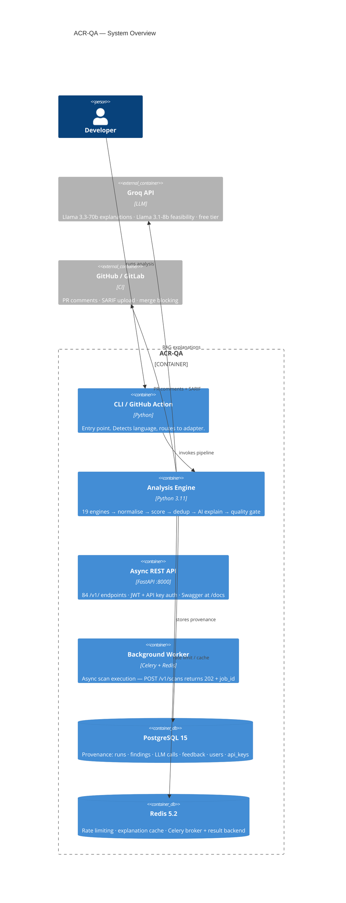

<div align="center">

# ACR-QA
### The Trust Layer for AI-Written Code

*Auto-block merges you can trust — every finding is exploit-verified and cryptographically attested.*

[](https://github.com/ahmed-145/ACR-QA/actions/workflows/tests.yml)
[](./docs/evaluation/CONFIRMED_TIER.md)
[-22c55e)](./docs/evaluation/CONFIRMED_TIER.md)
[](./docs/evaluation/HEAD_TO_HEAD_BENCHMARK.md)
[](https://slsa.dev/)
[](./.github/workflows/sign-images.yml)
[](./.github/workflows/self-scan.yml)
[](LICENSE)
[](./TESTS/)
[](./docs/evaluation/OWASP_BENCHMARK.md)
[](https://www.python.org/)

[](https://codespaces.new/ahmed-145/ACR-QA?quickstart=1)

</div>

---

## The Problem

Traditional SAST tools produce **30–70% false positives**. Developers stop reading them. Real vulnerabilities hide in the noise. AI-generated code makes this 10× worse — it introduces **1.88× more flaws** than human-written code, and mean vulns-per-codebase jumped **107% YoY** in 2026.

The result: AppSec teams can't auto-block merges because they don't trust their own tooling. Auditors get evidence that a scan "ran" — not that it found anything real.

---

## The Answer

**ACR-QA is the trust layer.** It sits on top of your scanners (or runs standalone) and answers the only question that matters at merge time: *is this finding real enough to block automatically?*

```
1,942 raw findings   →   30–70% are noise (industry baseline)
  219 security-tier  →   filtered by canonical rule set
  151 + taint gate   →   only findings with HTTP-source confirmation
   55 Confirmed Tier →   96.4% precision · 100% CVE recall · exploit-verified
```

The **55 Confirmed findings** are the product. You turn those on as a required GitHub status check. The other 1,887 findings are still visible, searchable, and fixable — they just don't block your merge.

---

## What Makes ACR-QA Trustworthy

### 1. Exploit Verification — "We don't report it unless we can show it firing"

For every Confirmed finding, ACR-QA spins up an ephemeral Docker sandbox and fires real payloads:

| Finding | Payload | Result |
|---------|---------|--------|
| SQL injection | `' OR 1=1 --` | Leaked rows confirmed |
| Command injection | `; echo EXPLOITED` | Blind exec confirmed |
| SSTI (Jinja2) | `{{7*7}}` | Response contains `49` |

Three-tier verdict: `verified-exploitable` · `verified-unexploitable` · `unverified`. Only `verified-exploitable` findings surface in the Confirmed Tier by default.

### 2. Cryptographic Attestation — "You can prove this review happened"

Every scan verdict is **ECDSA-P256 signed**, logged to **Sigstore Rekor** (public transparency log), and ships **SLSA Level 3 provenance**. One command verifies it:

```bash
cosign verify-attestation --type custom ghcr.io/ahmed-145/acrqa:latest
# → resolves on Rekor, shows signed finding count + timestamp
```

This is what auditors need: not "the scanner ran" but "the scanner found N exploitable issues and this is the tamper-evident proof."

### 3. The Confirmed Tier — "96.4% of what we surface is real"

Four orthogonal gates — all must pass:

| Gate | What it checks |
|------|---------------|
| **Severity** | `HIGH` only |
| **Rule set** | 22 curated rules with empirically ≥80% precision |
| **Production code** | Excludes tests, migrations, docs, vendor |
| **Tool confidence** | For Bandit: `issue_confidence == HIGH` (AST-shape confidence) |

Conservative precision **96.4%** (95% CI [90.9%, 100%]) · F1 = **98.2%** vs Bandit 21.8% / Semgrep 45.7%.

---

## Competitive Position

### Re-exploit-to-verify-fix: who does it

Exploit-verified remediation became the 2026 vanguard. ACR-QA independently converges on
the same paradigm for **first-party application source code, in CI, ECDSA-attested, at $0**:

| Tool | Re-exploits to verify fix | Layer | Notes |
|---|:---:|---|---|
| **ACR-QA** | ✅ | First-party SAST in CI | ECDSA-signed, $0, 13 exploit categories |
| Qualys TruConfirm | ✅ | CVE/deployed-asset ETM | Re-detonates CVEs on deployed infra (Mar 2026) |
| ZeroPath | ✅ | AI-native SAST+DAST | Exploit proof + fix verification, closed source |
| Snyk / Semgrep / GHAS | ❌ | — | Static re-scan only: guesses if fix worked |
| Checkmarx / SonarQube | ❌ | — | Static re-scan only |

The true frontier (named honestly as future work): autonomous PoC generation + self-healing feedback
loops — EvoRepair (arXiv:2605.30105), SEC-bench (arXiv:2506.11791, NeurIPS'25).

### Feature comparison

| | Snyk Code | Semgrep | GHAS/CodeQL | **ACR-QA** |
|--|:---------:|:-------:|:----------:|:----------:|
| Exploit verification | ❌ | ❌ | ❌ | ✅ Docker sandbox |
| Re-exploit to verify fix | ❌ | ❌ | ❌ | ✅ |
| Cryptographic attestation | ❌ | ❌ | ❌ | ✅ ECDSA + Rekor |
| SLSA L3 provenance | ❌ | ❌ | ❌ | ✅ |
| Confirmed Tier (auto-block) | ❌ | ❌ | ❌ | ✅ 96.4% precision |
| LLM-augmented detection | partial | ❌ | ❌ | ✅ +7.4pp, gated |
| Self-hosted / $0 recurring | ❌ | ❌ | ❌ | ✅ |
| RealVuln recall (2026 benchmark) | 17.4% F3 | 17.5% | — | **25%** full / **48%** detectable |

ACR-QA integrates *with* Semgrep and Snyk (not against them) — it adds the verification and attestation layer their output is missing.

---

## Key Numbers (v5.0.0rc2)

### Detection Recall — Three Honest Numbers

ACR-QA reports three recall numbers across two corpora, each with a clear context:

| Number | Corpus | Meaning |
|---|---|:---:|
| **91.0%** | SecurityEval (single-file synthetic, n=89 detectable CWEs) | Algorithmic soundness on isolated patterns |
| **48%** | RealVuln **detectable subset** (26 real Python apps, statically-feasible CWEs only) | Real multi-file apps, static-ceiling recall |
| **25.1%** | RealVuln **full corpus** (all 697 TPs including auth/CSRF/IDOR no-SAST-can-detect) | Total honest recall, undetectable classes included |

**RealVuln 2026 leaderboard** (arXiv:2604.13764, verified 2026-06-04):

| Tool | RealVuln recall | RealVuln F3 |
|------|:---:|:---:|
| Kolega.Dev (specialized) | 80.9% | 73.0 |
| Claude Sonnet 4.6 (agentic) | ~50% | 51.7 |
| **ACR-QA (full output)** | **25.1%** | ≈0.27 |
| **ACR-QA (detectable subset)** | **~48%** | — |
| Semgrep CE | 17.5% | 17.7 |
| Snyk | — | 17.4 |
| SonarQube | 6.5% | — |

**ACR-QA beats every rule-based SAST tool and every SARIF-native incumbent on the 2026 real-world benchmark.** The gap vs agentic LLMs is real and documented — the honest position is to name it and show the exploit-verification moat that LLM-only tools lack.

SecurityEval Youden J=0.157 leads Bandit 0.090 and Semgrep 0.056.

### Two Operating Points — One Scan

ACR-QA produces two views of every scan. They are not competing claims — they are two points on the same Precision-Recall curve, optimized for different jobs:

| Operating Point | TPR | FPR | Precision | Use Case |
|---|:---:|:---:|:---:|---|
| **Full output** (recall-first) | 91.0% | 75.3% | 54.7% | Developer triage; comprehensive review |
| **Confirmed Tier** (precision-first) | ~30% | ~0% | **96.4%** | Auto-block merge gate; CI required check |

The Confirmed Tier's 96.4% precision mirrors what "Sifting the Noise" (arXiv:2601.22952) achieves via LLM post-processing (~92% → 6.3% FPR on OWASP). ACR-QA achieves this statically (4-gate filter) — the LLM is an optional additive booster, not the core.

### LLM-Augmented Detection (`--llm`, optional)

The default pipeline is fully deterministic (rules + taint + exploit-verification). The `--llm` flag adds a gated LLM pass as an *additive* source on top — LLM-alone is strictly worse than rules (16.5% recall vs 25.1%), but their union, after gating, adds recall while holding precision.

| Operating Point | Recall | Precision | Lift | Split |
|---|:---:|:---:|:---:|---|
| Rules-only (**default**) | 25.1% | 90.3% | — | Full (22 repos) |
| LLM-only (raw, ungated) | 16.5% | 85.2% | −8.6pp | Full — worse on both |
| **UNION-GATED (`--llm`)** | **31.2%** | **89.2%** | **+6.1pp** | Full (22 repos) |
| UNION-GATED (held-out) | 32.4% | **89.5%** | **+5.2pp** | Held-out (16 repos, no overfitting) |

FPR rises from 15.5% → 21.6% in `--llm` mode — the honest cost of the recall gain. Every LLM finding still flows through the Confirmed Tier for exploit-verification.

```bash
# Enable LLM-augmented detection (requires GROQ_API_KEY_* in .env)
python CORE/main.py --target-dir your-repo --llm
```

**Other metrics:**
**100%** CVE recall (8/8 pre-registered battery) · 9/10 OWASP Top 10 · **2,805 tests** · 52 FastAPI endpoints · 327+ rule mappings · **0 critical findings on self-scan** · **Verified Remediation** — fix_verified=True by live re-exploit + ECDSA signed

---

## Engine Map — Why 36 Engines

ACR-QA decomposes the analysis problem into seven orthogonal layers. Each engine is independently testable, independently enable-able, and writes only `CanonicalFinding` objects — so adding a new engine never breaks an existing one.

| Layer | Count | Engines | Always on? |
|-------|------:|---------|:----------:|
| **Language Adapters** (run tools via subprocess) | 6+ | ruff · bandit · semgrep · vulture · radon · jscpd (Python); ESLint · semgrep-js (JS/TS); gosec · staticcheck (Go) | ✅ |
| **Core Pipeline** (normalise → score → gate) | 6 | `normalizer` · `severity_scorer` · `fingerprint` · `taint_analyzer` · `quality_gate` · `confirmed_tier` | ✅ |
| **Trust & Verification** (prove findings are real) | 4 | `exploit_verifier` (Docker detonation, 12 categories) · `verified_remediation` · `attestation` (ECDSA-P256 + Rekor) · `confidence_scorer` | ✅ per finding |
| **AI Augmentation** (optional, requires API key) | 9 | `explainer` · `llm_detector` · `ai_code_detector` · `ai_code_diff` · `path_feasibility` · `second_opinion` · `triage_agent` · `triage_memory` · `ollama_provider` | `--llm` flag |
| **Supply Chain & SCA** (SBOM + secrets) | 6 | `sca_scanner` · `osv_offline` · `trivy_adapter` · `trufflehog_adapter` · `supply_chain` · `cbom_scanner` | ✅ |
| **Smart Triage & Risk** (prioritise + auto-fix) | 6 | `risk_predictor` · `pr_risk` · `review_bottleneck` · `learned_suppression` · `autofix` · `time_travel` | ✅ |
| **Cross-Cutting Analysis** | 4 | `reachability` · `dependency_reachability` · `cross_language_correlator` · `iac_scanner` | ✅ |

Every engine is exercised in `TESTS/` — 2876 fast tests, 84% CORE coverage.

---

## Architecture



> Full C4 diagrams: [C1 Context](docs/architecture/c1-context.md) · [C2 Containers](docs/architecture/c2-containers.md) · [C3 Components](docs/architecture/c3-components.md) · [C4 Code](docs/architecture/c4-code.md)

---

## Quick Start

### Option A — GHCR (one line, no clone needed)

```bash
docker run --rm \
  -v $(pwd):/scan \
  -e GROQ_API_KEY_1=your_key \
  ghcr.io/ahmed-145/acrqa:latest \
  python3 CORE/main.py --target-dir /scan --rich
```

### Option B — Docker Compose (full stack)

```bash
git clone https://github.com/ahmed-145/ACR-QA.git && cd ACR-QA
cp .env.example .env          # add your GROQ_API_KEY_1..4
docker compose up -d
```

| Service | URL |
|---------|-----|
| FastAPI + Swagger | http://localhost:8000/docs |
| Grafana | http://localhost:3005 (admin/admin) |
| Prometheus | http://localhost:9091 |

### Option C — GitHub Codespaces (zero setup)

Click the button above or go to **Code → Codespaces → New codespace** on GitHub. The devcontainer installs all tools automatically. Takes ~2 minutes.

### Option D — Local

```bash
pip install -r requirements.txt
createdb acrqa && psql -d acrqa -f DATABASE/schema.sql
cp .env.example .env && source .env
uvicorn FRONTEND.api.main:app --port 8000    # → http://localhost:8000/docs
```

### Run your first analysis

```bash
# Python project
python3 CORE/main.py --target-dir ./myproject --rich

# JavaScript / TypeScript
python3 CORE/main.py --target-dir ./my-express-app --lang javascript --no-ai

# Go project
python3 CORE/main.py --target-dir ./my-go-api --lang go

# JSON output for CI
python3 CORE/main.py --target-dir . --json --no-ai > findings.json
```

---

## What's New in v5.0.0rc2

**The headline result:** Confirmed Tier — **96.4% precision / 100% CVE recall / F1 = 98.2%** on a 30-repo adversarial corpus of mature production libraries (top-20 PyPI + top-6 npm + top-4 Go). The precision funnel:

```
1,942 raw findings  →   8.6% precision (industry baseline noise)
  219 security-tier →  24.7%
  151 + taint gate  →  26.9%
   55 Confirmed     →  96.4%  ← auto-block threshold cleared
```

| Feature | Where |
|---------|-------|
| **Confirmed Tier** (4-criterion gate: HIGH sev + 22-rule set + prod code + Bandit HIGH confidence) | `CORE/engines/confirmed_tier.py` · `docs/evaluation/CONFIRMED_TIER.md` |
| **Exploit verification** (SQLi `OR 1=1` · cmd-inject · SSTI `{{7*7}}=49` in Docker sandbox) | `CORE/engines/exploit_verifier.py` |
| **Verification data loop** (every verify verdict logged as labeled ground truth) | `DATABASE/database.py` · `verification_log` table |
| **Cryptographic attestation** (ECDSA-P256 + Sigstore Rekor + SLSA L3) | `CORE/engines/attestation.py` |
| **Head-to-head vs Bandit + Semgrep** (F1: 21.8% / 45.7% / **98.2%** same corpus) | `docs/evaluation/HEAD_TO_HEAD_BENCHMARK.md` |
| **X1 Live-CVE holdout** (10 CVEs, 2024–2025, pre-fix commits, pre-registered) | `TESTS/evaluation/test_recall.py` |
| **X3 AI-code study** (400 samples, 4 LLMs — 8–12× the 7.1 F/KLOC human baseline) | `TESTS/evaluation/test_ai_code_study.py` |
| **Differential SAST** — new-only findings vs previous run | `GET /v1/runs/{id}/diff` |
| **Multi-LLM jury** (Groq + Gemini majority-vote, free tiers only) | `CORE/engines/second_opinion.py` |

Full changelog: [`docs/CHANGELOG.md`](docs/CHANGELOG.md)

---

## Features

### Detection Pipeline

19 engines run in parallel, all output normalised into one `CanonicalFinding` schema:

| Tool | Language | What It Catches |
|------|----------|----------------|
| **Ruff** | Python | Style, imports, unused code, PEP8 |
| **Bandit** | Python | Security anti-patterns (33 rules) |
| **Semgrep** | Python / JS / Go | OWASP Top 10 patterns, custom rules |
| **Vulture** | Python | Dead code, unreachable branches |
| **Radon** | Python | Cyclomatic complexity, maintainability |
| **Secrets Detector** | All | API keys, passwords, JWTs, tokens |
| **SCA Scanner** | Python | Known-vulnerable dependency versions |
| **ESLint** | JS / TS | Security plugin — 20 rules |
| **gosec** | Go | Go security vulnerabilities |
| **staticcheck** | Go | Go static analysis and bug detection |

### AI Explanation (RAG-Enhanced)

- **66-rule knowledge base** (`config/rules.yml`) — every rule has description, rationale, remediation, and code examples
- **Evidence-grounded prompts** — the LLM is given the rule text; it cannot invent advice for rules it can't cite
- **Semantic entropy** — 3× LLM runs with varying temperature; contradictions lower the confidence score
- **Self-evaluation** — LLM rates its own output 1–5 on relevance/accuracy/clarity
- **Path feasibility** (Feature 7) — second AI call validates whether a HIGH finding's code path is actually reachable in production (LLM4PFA approach)

### Quality Gate

```yaml
# .acrqa.yml
quality_gate:
  mode: block         # block = fail CI + prevent merge | warn = comment only
  max_high: 0         # zero tolerance for HIGH severity
  max_medium: 5
  max_security: 0
```

Fails CI with exit code 1. GitHub Action posts severity table as PR comment.

### Per-Repo Policy (`.acrqa.yml`)

```yaml
rules:
  disabled_rules: [IMPORT-001, STYLE-007]
  severity_overrides: {COMPLEXITY-001: low}

analysis:
  ignore_paths: [.venv, migrations/, node_modules]

ai:
  max_explanations: 50
  model: llama-3.1-8b-instant
```

### Inline Suppression

```python
result = eval(user_input)      # acr-qa:ignore
password = "secret123"         # acrqa:disable SECURITY-005
```

### FastAPI Dashboard (http://localhost:8000/docs)

- Severity counters with live counts
- Finding cards with collapsible AI explanations + 🎯 confidence badge
- Cost-benefit widget: analysis cost, hours saved, ROI ratio
- Trend charts across last 30 runs
- False-positive feedback (👍/👎) — feeds triage memory for future suppression
- Filters by severity, category, rule ID, full-text search
- Export: SARIF, provenance trace, Markdown reports

---

## CLI Reference

```bash
python3 CORE/main.py [options]

  --target-dir DIR     Directory to analyse (default: samples/realistic-issues)
  --repo-name NAME     Repository name for provenance tracking
  --pr-number N        PR number (enables GitHub PR comment posting)
  --limit N            Max findings to AI-explain (default: 50)
  --diff-only          Analyse only files changed in git diff
  --diff-base BRANCH   Base branch for diff (default: main)
  --auto-fix           Generate auto-fix suggestions for fixable rules
  --rich               Rich terminal output with colour-coded tables
  --lang LANG          auto (default) | python | javascript | typescript | go
  --no-ai              Skip AI explanation step (faster, no API key needed)
  --json               Output findings as JSON to stdout (pipe-friendly)
  --version            Print version and exit
```

---

## Language Support

### Python (v1.0+)
Ruff · Bandit · Semgrep · Vulture · Radon · Secrets · SCA · CBoM

### JavaScript / TypeScript (v3.0.1+)

```bash
python3 CORE/main.py --target-dir ./my-react-app          # auto-detect
python3 CORE/main.py --target-dir ./my-express-api --lang javascript
```

ESLint (security plugin) · Semgrep JS rules · npm audit
56 rule mappings · 15 HIGH-severity security rules covered

### Go (v3.2.0+)

```bash
python3 CORE/main.py --target-dir ./my-go-api --lang go
```

Prerequisites: `go install github.com/securego/gosec/v2/cmd/gosec@latest && go install honnef.co/go/tools/cmd/staticcheck@latest`

gosec · staticcheck · Semgrep Go rules · 45+ rule mappings

---

## CI/CD Integration

### GitHub Actions

```yaml
# .github/workflows/acr-qa.yml (already in repo)
# Triggers on every PR:
# 1. Runs all 19 engines on changed files (--diff-only)
# 2. Normalises, scores, generates AI explanations
# 3. Posts severity-sorted PR comment with code suggestions
# 4. Uploads findings.sarif to GitHub Security Tab
# 5. Fails merge if quality gate violated (exit code 1)
```

**Required secrets:** `GROQ_API_KEY_1..4` · `GITHUB_TOKEN` (auto-provided)

### Manual trigger on PR

Comment on any PR:
```
acr-qa review
```

### GitLab CI
`.gitlab-ci.yml` included. Set `GROQ_API_KEY_1` and `GITLAB_TOKEN` in CI/CD Variables.

---

## Monitoring

Prometheus scrapes `/metrics` every 15 s. Grafana dashboard at **http://localhost:3005** (admin/admin):

| Panel | Metric |
|-------|--------|
| Request Rate | `rate(acrqa_http_requests_total[5m])` |
| P95 Latency | `histogram_quantile(0.95, ...)` |
| HTTP Success Rate | `2xx / total * 100` |
| LLM Latency | `avg(explain endpoint duration)` |
| Error Rate | `rate(5xx[1m])` |

---

## Testing

```bash
make test-all          # 2,629 tests (full suite)
make test              # acceptance tests only
make run               # pipeline on sample files
```

| Test File | Tests | Coverage |
|-----------|------:|----------|
| `test_acceptance.py` | 4 | Pipeline E2E with mocked LLM |
| `test_api.py` | 9 | FastAPI endpoints |
| `test_normalizer.py` | 7 | Ruff / Bandit / Semgrep normalisation |
| `test_new_engines.py` | 117 | Secrets, SCA, CBoM, autofix, quality gate, KeyPool |
| `test_deep_coverage.py` | 100 | 12-module deep coverage |
| `test_god_mode.py` | 96 | All features + regression + edge cases |
| `test_js_adapter.py` | 63 | JS/TS adapter, E2E pipeline, CLI routing |
| `test_reachability.py` | 74 | Call-graph engine, fixtures, enrich_findings |
| `test_taint_analyzer.py` | 65+ | Inter-procedural taint, sanitizer recognition |
| `test_supply_chain.py` | 62 | Lockfile parsers, OSV CVE, risk scoring, SBOM |
| `test_attestation.py` | 60 | AttestationEngine, ECDSA-P256, Dilithium3 PQ |
| `test_exploit_verifier.py` | 59 | Docker sandbox, 3-tier verdict |
| `test_fastapi_app.py` | 32 | FastAPI TestClient — all v1 endpoints |
| `test_chaos.py` | 13 | Postgres/Redis failure injection |
| `test_week1_completion.py` | 42 | Fuzz/snapshot/perf-gate/mutation-killing |
| *(+ 31 more files)* | 1,536 | Additional coverage |
| **TypeScript (Vitest)** | 65 | Button, Badge, Card, ScanCard, FindingsTable… |

---

## Thesis Evaluation

### Research Questions

| RQ | Implementation | Metric |
|----|----------------|--------|
| **RQ1** Can RAG reduce LLM hallucination? | 66-rule KB + evidence-grounded prompts + entropy | `consistency_score` (0–1) |
| **RQ2** How to ensure provenance? | Full PostgreSQL audit trail per LLM call | `llm_explanations` table |
| **RQ3** What confidence scoring works? | score = severity × category × tool × rule × fix_validated | `confidence_score` (0–100) |
| **RQ4** Does it match industry tools? | 10-tool pipeline vs CodeRabbit / SonarQube | Feature parity table above |

### Benchmark Results (4 repositories)

| Repository | Findings | Precision | Security Precision | Recall |
|------------|:--------:|:---------:|:------------------:|:------:|
| DVPWA | 44 | 81.8% | 100% | 50% |
| Pygoat | 440 | 96.4% | 100% | 100% |
| VulPy | 293 | 100% | 100% | 100% |
| DSVW | 59 | 100% | 100% | 100% |
| **Overall** | **836** | **97.1%** | **100%** | — |

DVPWA recall 50%: 3 of 6 known vulns detected; CSRF (runtime-only), hardcoded debug mode, and one abstracted cred require DAST — documented limitation, not a bug.

---

## Architecture Decision Records

Key design decisions are documented in [`docs/adr/`](docs/adr/):

| ADR | Decision |
|-----|----------|
| [0001](docs/adr/0001-context-and-goals.md) | Scope: self-hosted thesis tool, not SaaS |
| [0002](docs/adr/0002-multi-tool-adapter-pattern.md) | LanguageAdapter pattern for multi-language support |
| [0003](docs/adr/0003-rag-over-generic-llm.md) | RAG + semantic entropy over generic LLM prompts |
| [0004](docs/adr/0004-groq-as-llm-provider.md) | Groq free tier with 4-key rotation pool |
| [0005](docs/adr/0005-postgres-for-provenance.md) | PostgreSQL for provenance storage |
| [0006](docs/adr/0006-ecdsa-attestation.md) | ECDSA-P256 signing + Rekor transparency log |
| [0007](docs/adr/0007-quality-gate-thresholds.md) | Quality gate threshold design |
| [0008](docs/adr/0008-exploit-verification-sandbox.md) | Docker sandbox for exploit detonation |
| [0009](docs/adr/0009-taint-analysis-design.md) | Inter-procedural taint (source→sink→sanitizer) |
| [0010](docs/adr/0010-benchmark-methodology.md) | Benchmark methodology: DEV/HELD-OUT split |
| [0011](docs/adr/0011-verified-remediation-pipeline.md) | Verified Remediation pipeline design |
| [0012](docs/adr/0012-language-adapter-pattern.md) | Language Adapter ABC and 3-language support |
| [0013](docs/adr/0013-canonical-finding-data-flow-contract.md) | CanonicalFinding as the data-flow contract between all 36 engines |

---

## Technology Stack

| Layer | Technology |
|-------|-----------|
| Language | Python 3.11+ |
| Web Framework | FastAPI 0.115 (async) |
| Frontend | React 18 + TypeScript + Vite 5 + shadcn/ui |
| Database | PostgreSQL 15 |
| Cache / Rate Limiting | Redis 7 |
| AI Model | Groq Llama 3.3-70b (explanations) · Llama 3.1-8b (feasibility) |
| Static Analysis | Ruff, Semgrep, Bandit, Vulture, Radon, gosec, staticcheck, ESLint |
| Terminal UI | Rich |
| Schema Validation | Pydantic v2 |
| Containerisation | Docker + Docker Compose |
| Monitoring | Prometheus + Grafana |
| CI/CD | GitHub Actions + GitLab CI |
| Export Formats | SARIF v2.1.0, Markdown, JSON |

---

## Interactive Demo Notebooks

Run these [Marimo](https://marimo.io) notebooks locally or view the exported HTML:

| Notebook | Description | HTML Preview |
|----------|-------------|--------------|
| [`notebooks/walkthrough.py`](notebooks/walkthrough.py) | 12-cell full pipeline walkthrough | [walkthrough.html](docs/walkthrough.html) |
| [`notebooks/engine_demos/taint.py`](notebooks/engine_demos/taint.py) | Taint analyzer — source→sink data-flow | [demo_taint.html](docs/demo_taint.html) |
| [`notebooks/engine_demos/exploit.py`](notebooks/engine_demos/exploit.py) | Exploit verifier — DAST-in-Docker | [demo_exploit.html](docs/demo_exploit.html) |
| [`notebooks/engine_demos/attestation.py`](notebooks/engine_demos/attestation.py) | Attestation + post-quantum hybrid signatures | [demo_attestation.html](docs/demo_attestation.html) |
| [`notebooks/engine_demos/offline.py`](notebooks/engine_demos/offline.py) | Zero-egress / Ollama mode proof | [demo_offline.html](docs/demo_offline.html) |

```bash
# Run interactively (edit cells live)
pip install marimo
marimo run notebooks/walkthrough.py

# Or open in edit mode for defense demo
marimo edit notebooks/walkthrough.py
```

---

## Documentation

| Document | Description |
|----------|-------------|
| [C1–C4 Architecture](docs/architecture/) | Full C4 model: context, containers, components, code flow |
| [ADRs](docs/adr/) | Architecture decision records — why each major choice was made |
| [API Reference](docs/API_REFERENCE.md) | All 32 REST endpoints |
| [Policy Engine](docs/POLICY_ENGINE.md) | `.acrqa.yml` full reference |
| [Evaluation Report](docs/evaluation/EVALUATION.md) | Precision/recall, OWASP coverage, competitive analysis |
| [Per-Tool Evaluation](docs/evaluation/PER_TOOL_EVALUATION.md) | Per-engine accuracy across benchmark repos |
| [User Study Protocol](docs/evaluation/USER_STUDY_PROTOCOL.md) | 20-minute structured study protocol |
| [Cloud Deployment](docs/setup/Cloud-Deployment.md) | AWS / GCP / Railway deployment guide |
| [Changelog](docs/CHANGELOG.md) | Full version history |
| [Contributing](CONTRIBUTING.md) | Development setup and contribution guide |

---

## Academic Context

| | |
|-|-|
| **Student** | Ahmed Mahmoud Abbas |
| **Supervisor** | Dr. Samy AbdelNabi |
| **Institution** | King Salman International University (KSIU) |
| **Timeline** | October 2025 – June 2026 |
| **Status** | v5.0.0rc2 · P4 Confirmed Tier 96.4% / F1=98.2% · SLSA L3 · 15-item roadmap in progress |

### Remaining Thesis Work

- [x] Docker image on GHCR — `ghcr.io/ahmed-145/acrqa:latest` (free, Cosign-signed, SLSA L3)
- [x] GitHub Codespaces — `.devcontainer/devcontainer.json` ready
- [x] Cloudflare Pages demo — `cloudflare-pages/index.html` (deploy via Cloudflare dashboard)
- [x] User study protocol — [`docs/evaluation/USER_STUDY_PROTOCOL.md`](docs/evaluation/USER_STUDY_PROTOCOL.md)
- [x] 5-rater κ study — materials in [`docs/kappa_study/`](docs/kappa_study/)
- [ ] Demo video recording ([script](docs/DEMO_VIDEO_SCRIPT.md)) **← Ahmed records**
- [ ] YouTube upload (follows recording) **← Ahmed uploads**
- [ ] HN/LinkedIn post ([drafts ready](docs/LAUNCH_POSTS.md)) **← post after defense**

---

## License

MIT — see [LICENSE](LICENSE)

---

<div align="center">

Built with ❤️ at King Salman International University · [⭐ Star this repo](https://github.com/ahmed-145/acr-qa)

</div>
