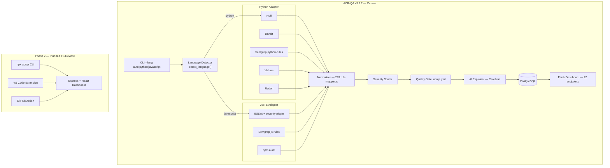

# ACR-QA Roadmap

**Project:** Automated Code Review & Quality Assurance
**Author:** Ahmed Mahmoud Abbas — Graduation Thesis, KSIU
**Supervisor:** Dr. Samy

---

## Architecture Overview



---

## Where We Are Now

### ✅ Phase 1 — Python MVP (COMPLETE, v3.1.0)

- ✅ Feature 2: Cryptographic Bill of Materials (CBoM) — quantum-safety classification per NIST FIPS 203/204 (done — v3.0.4)
- ✅ Feature 3: Configurable Merge-Blocking Quality Gate — `block` vs `warn` mode (done — v3.0.5)
- ✅ Feature 4: Autofix PRs — bot opens PR with validated AI-generated fixes applied automatically (done — v3.0.7)
- ✅ Feature 5: Confidence scoring — every finding gets 0-100 score, threshold slider in dashboard (done — v3.0.8)
- ✅ Feature 6: Triage memory — FP marking auto-suppresses similar findings in future scans (done — v3.0.9)
- ✅ Feature 7: AI path feasibility validator — second AI call validates execution path reachability, cites LLM4PFA (done — v3.1.0)
- ✅ Feature 8: Dependency reachability — checks if vulnerable npm package is actually called in source (done — v3.1.1)
- ✅ Feature 9: Cross-language vulnerability correlation — Python Flask → JS/template taint tracking, cites CHARON (done — v3.1.2)

The Python version is **feature-complete and thesis-ready**.


#### What's in it

| Component | Status | Details |
|-----------|--------|---------|
| Analysis Pipeline | ✅ | Ruff → Bandit → Semgrep → Vulture → Radon → jscpd → normalize → score → gate → explain |
| Normalizer | ✅ | 139+ rule mappings → canonical IDs (SECURITY-xxx, STYLE-xxx, etc.) |
| Severity Scorer | ✅ | Per-rule severity from `RULE_SEVERITY` dict (high/medium/low) |
| Quality Gate | ✅ | Configurable via `.acrqa.yml` — blocks CI on policy violation |
| AI Explanations | ✅ | Cerebras LLM — explains each finding + suggests fix |
| Auto-fix | ✅ | Ruff `--fix` applied automatically for fixable issues |
| OWASP Mapping | ✅ | 9/10 OWASP Top 10 categories covered |
| Flask Dashboard | ✅ | 22 REST endpoints — runs, findings, stats, trends, compliance, suppression-rules |
| PostgreSQL + Redis | ✅ | Full persistence + caching layer |
| Triage Memory | ✅ | FP feedback auto-creates suppression rules; future scans skip matching findings |
| Path Feasibility | ✅ | Second AI call validates execution path reachability for HIGH/CRITICAL findings (LLM4PFA) |
| CLI | ✅ | `--version`, `--no-ai`, `--json`, `--lang`, `--rich`, `--diff-only`, `--auto-fix` |
| Tests | ✅ | 497 passing (5 test files) |
| Docs | ✅ | API_REFERENCE.md, EVALUATION.md, TESTING_AND_CALIBRATION.md, AGENTS.md |

#### Repos tested (Round 1–5)
Django, SQLAlchemy, aiohttp, black, Pillow, DVPWA, Flask, httpx, requests, + 9 mass-test repos.

---

### ✅ Phase 1B — JavaScript/TypeScript Support (COMPLETE, v3.0.3)

ACR-QA now works on **JS/TS projects** without any architecture change.

#### What's in it

| Component | File | Details |
|-----------|------|---------|
| JS Adapter | `CORE/adapters/js_adapter.py` | ESLint, Semgrep JS, npm audit, normalization |
| Semgrep JS Rules | `TOOLS/semgrep/js-rules.yml` | 21 rules (eval+test-exclusions, XSS, SQLi, NoSQL `$where`, SSRF, prototype pollution, path traversal, JWT, etc.) |
| ESLint Config | Generated at runtime | eslint-plugin-security + 20 core rules |
| Language Detection | `JavaScriptAdapter.detect_language()` | Auto-detects python/javascript/mixed from project structure |
| JS Rule Mappings | `JS_RULE_MAPPING` in js_adapter.py | 56 ESLint/Semgrep rule → canonical ID mappings |
| JS Severity | `severity_scorer.py` | SECURITY-051..060, STYLE-017/018, ASYNC-002/003, VAR-002, PATTERN-002 |
| npm audit SCA | `normalize_npm_audit()` | CVE dependency scans → SECURITY-059/060 |
| Tests | `TESTS/test_js_adapter.py` | 39 tests — rule mapping, normalization, language detection |

#### How to use it

```bash
# Auto-detect (looks for package.json, .js/.ts files)
python -m CORE --target-dir /path/to/express-app

# Force JS mode
python -m CORE --target-dir /path/to/next-app --lang javascript --no-ai

# JSON output for JS consumers
python -m CORE --target-dir /path/to/react-app --lang javascript --no-ai --json > results.json
```

#### Security rules covered (JS)
| Rule | Canonical ID | Severity |
|------|-------------|---------|
| eval() / new Function() injection | SECURITY-001 | HIGH |
| SQL injection (string concat) | SECURITY-027 | HIGH |
| NoSQL injection (MongoDB) | SECURITY-058 | HIGH |
| XSS (innerHTML, document.write) | SECURITY-045 | HIGH |
| Prototype pollution | SECURITY-057 | HIGH |
| Path traversal (fs + req.params) | SECURITY-049 | HIGH |
| Command injection (exec/spawn) | SECURITY-021 | HIGH |
| Hardcoded secrets | SECURITY-005 | HIGH |
| JWT none algorithm | SECURITY-047 | HIGH |
| Dynamic require() | SECURITY-052 | HIGH |
| Object injection | SECURITY-056 | HIGH |
| ReDoS (unsafe regex) | SECURITY-051 | HIGH |
| CSRF before method-override | SECURITY-055 | HIGH |
| Open redirect | SECURITY-048 | MEDIUM |
| Math.random() (weak crypto) | SECURITY-037 | MEDIUM |
| npm CVE critical/high | SECURITY-059 | HIGH |
| npm CVE moderate | SECURITY-060 | MEDIUM |

---

## What Comes Next

### 🔜 Phase 2 — Full TypeScript/JS Engine Rewrite

> **Why:** The Python backend works. But to build a real VS Code extension, GitHub Action in the marketplace, or a Next.js-native tool — everything needs to run in Node/TypeScript natively. Python won't be installed in every target environment.

#### The goal

Rewrite the ACR-QA engine in **TypeScript**, making it:
- Installable as an npm package: `npm install -g acrqa`
- Native VS Code extension (no Python runtime required)
- GitHub Action written in JS
- Embeddable in any Node.js/Next.js/React app

#### Architecture plan (TS rewrite)

```
acrqa-ts/
├── packages/
│   ├── core/                    # Engine (scanner, normalizer, scorer, gate)
│   │   ├── src/
│   │   │   ├── adapters/
│   │   │   │   ├── eslint.ts    # ESLint runner + normalizer
│   │   │   │   ├── semgrep.ts   # Semgrep runner (subprocess)
│   │   │   │   ├── npm-audit.ts # npm audit runner
│   │   │   │   └── base.ts      # ILanguageAdapter interface
│   │   │   ├── normalizer.ts    # rule_id → canonical_id mapping
│   │   │   ├── scorer.ts        # severity scoring
│   │   │   ├── quality-gate.ts  # gate logic (same policy as Python)
│   │   │   ├── ai.ts            # LLM explanation (Gemini/Cerebras via fetch)
│   │   │   └── pipeline.ts      # orchestrator
│   │   └── package.json
│   ├── cli/                     # `npx acrqa` CLI
│   │   └── src/index.ts
│   ├── vscode/                  # VS Code extension
│   │   └── src/extension.ts
│   └── action/                  # GitHub Action
│       └── src/main.ts
├── rules/
│   └── semgrep/
│       ├── python-rules.yml     # Same as current TOOLS/semgrep/
│       └── js-rules.yml         # Same as current TOOLS/semgrep/
└── tsconfig.json
```

#### Implementation order (Phase 2)

**Step 1 — Core engine in TS** *(~1 week)*
- Port `JS_RULE_MAPPING` from `js_adapter.py` → `normalizer.ts`
- Port severity scoring dict → `scorer.ts`
- Port quality gate logic → `quality-gate.ts`
- Run ESLint and npm audit as subprocesses, parse JSON output
- Write tests with Vitest

**Step 2 — CLI** *(~2 days)*
```bash
npx acrqa --target-dir ./src
npx acrqa --target-dir ./src --lang python  # calls Python adapter via subprocess
npx acrqa --target-dir ./src --json > results.json
```

**Step 3 — VS Code Extension** *(~1 week)*
- Runs `acrqa` on save / on demand
- Underlines findings inline (like ESLint does)
- Sidebar panel with findings list
- Click finding → jump to file:line
- This is the flagship UI for the thesis demo

**Step 4 — GitHub Action** *(~2 days)*
```yaml
# .github/workflows/acrqa.yml
- uses: ahmed-145/acrqa-action@v1
  with:
    target-dir: ./src
    fail-on: high
```
- Posts findings as PR comment
- Fails pipeline if quality gate fails
- Language auto-detected (python or JS/TS)

**Step 5 — AI in TS** *(~3 days)*
- Replace Cerebras Python client with `fetch()` to Gemini API
- Explain findings in JSON format
- Expose via `/api/explain` endpoint in a lightweight Express server

#### What carries over from Python (no rewrite needed)
| Item | Status |
|------|--------|
| `TOOLS/semgrep/python-rules.yml` | ✅ used as-is (Semgrep is language-agnostic) |
| `TOOLS/semgrep/js-rules.yml` | ✅ used as-is |
| `config/rules.yml` (knowledge base) | ✅ read as YAML in TS |
| `.acrqa.yml` policy format | ✅ identical schema |
| `JS_RULE_MAPPING` (55 entries) | ✅ port to `normalizer.ts` |
| `RULE_SEVERITY` (139+ entries) | ✅ port to `scorer.ts` |
| REST API contract | ✅ documented in `docs/API_REFERENCE.md` |

#### What to NOT port
- Flask dashboard → replace with a lightweight Express + React app (or just use the Python one for demo)
- PostgreSQL schema → keep Python backend as data layer, TS engine calls the REST API
- Pytest tests → rewrite in Vitest

#### Recommended JS stack for Phase 2
| Need | Tool |
|------|------|
| Language | TypeScript 5.x |
| Runtime | Node.js 20+ (LTS) |
| Package manager | pnpm (monorepo) |
| Build | tsup (fast TS bundler) |
| Tests | Vitest |
| Linting | ESLint + @typescript-eslint |
| AI | Gemini 2.0 Flash via `fetch()` |
| VS Code extension | `vscode` npm package |

---

## Decision Guide: When to Use Which

| Scenario | Recommendation |
|----------|---------------|
| Thesis demo (right now) | Python v3.0 — it works, it's tested, it's documented |
| Scan a JS/TS project (right now) | `python -m CORE --lang javascript --no-ai` |
| VS Code extension (Phase 2) | TS rewrite — native extension API |
| GitHub Action in marketplace | TS rewrite — JS actions are faster and don't need Python |
| CLI for developers | TS rewrite — `npm install -g acrqa` is more universal |
| Long-term SaaS / multi-language | TS rewrite with Python as a subprocess adapter for Bandit/Ruff |

---

## Known Limitations (Python Version — Documented)

| Limitation | Root cause | Plan |
|-----------|-----------|------|
| B324 hashlib FPs on Django/SQLAlchemy | Bandit flags ALL MD5 regardless of intent | Phase 2: context-aware rule |
| CSRF not detected | High FP rate on API-only apps | Phase 2: session-auth detection first |
| No JS AST analysis | ESLint covers most cases but no semantic graph | Phase 2: tree-sitter or Ox-security |
| AI explanations require API key | Cerebras needed at runtime | Phase 2: optional, fallback to rule description |
| No VS Code integration | Python-first architecture | Phase 2: TS extension |

---

## File Map (Current Python v3.0)

```
CORE/
├── __init__.py          ← version string (3.0.3)
├── main.py              ← CLI: --version, --no-ai, --json, --lang
├── config_loader.py     ← reads .acrqa.yml policy
└── engines/
│   ├── normalizer.py    ← 139+ rule → canonical ID mappings
│   ├── severity_scorer.py ← RULE_SEVERITY dict (60-SECURITY + js +...)
│   ├── explainer.py     ← Cerebras AI explanation
│   ├── autofix.py       ← Ruff --fix automation
│   └── quality_gate.py  ← gate logic
└── adapters/
    ├── base.py          ← LanguageAdapter ABC
    ├── python_adapter.py ← Ruff, Bandit, Semgrep, Vulture, Radon, jscpd
    └── js_adapter.py    ← ESLint, Semgrep JS, npm audit [NEW v3.0.1]

TOOLS/
└── semgrep/
    ├── python-rules.yml ← 15 Python security rules
    └── js-rules.yml     ← 15 JS security rules [NEW v3.0.1]

FRONTEND/
└── app.py               ← Flask dashboard, 22 REST endpoints

DATABASE/
└── database.py          ← PostgreSQL: runs, findings, explanations, feedback, metrics

TESTS/
├── test_core.py         ← Core pipeline tests
├── test_deep_coverage.py ← 98 deep coverage tests
├── test_god_mode.py     ← 78 god-mode tests
├── test_integration.py  ← Integration tests
└── test_js_adapter.py   ← 48 tests — JS adapter, E2E pipeline, CLI routing [NEW v3.0.1]

docs/
├── API_REFERENCE.md     ← 22 REST endpoints + CLI + JS usage [v3.0.0]
├── ROADMAP.md           ← THIS FILE [v3.0.1]
├── TESTING_AND_CALIBRATION.md ← Round 1-5 repo testing results
├── AGENTS.md            ← AI agent instructions (replaces AGENTS.md at root)
└── evaluation/
    └── EVALUATION.md    ← Precision, recall, FP rates, competitor comparison
```

---

*Last updated: April 21, 2026 — ACR-QA v3.1.0*
