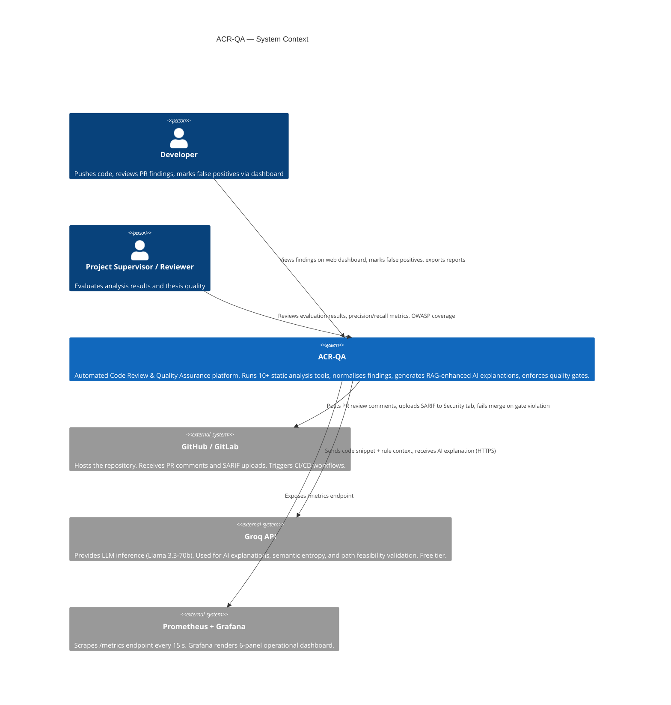

# C1 — System Context Diagram

> Level 1 of the C4 model. Shows ACR-QA as a black box and everything it talks to.

## Key relationships

| Relationship | Direction | Protocol | Notes |
|---|---|---|---|
| Developer → CLI | Push | stdin / shell | `python3 CORE/main.py --target-dir ./repo` |
| GitHub Actions → ACR-QA | Trigger | GitHub Actions runner | `.github/workflows/acr-qa.yml` |
| ACR-QA → GitHub | Post | REST API (HTTPS) | PR comments + SARIF upload |
| ACR-QA → Groq | Request | HTTPS | Key pool of 4 keys for rate limit bypass |
| Prometheus → ACR-QA | Scrape | HTTP `/metrics` | Every 15 seconds |

## What ACR-QA does NOT do

- Does not detect CSRF, IDOR, auth bypass, or business logic bugs (static analysis limits — by design)
- Does not store code on external servers (Groq only receives the relevant snippet + rule text)
- Does not require cloud hosting — designed for local or self-hosted deployment
