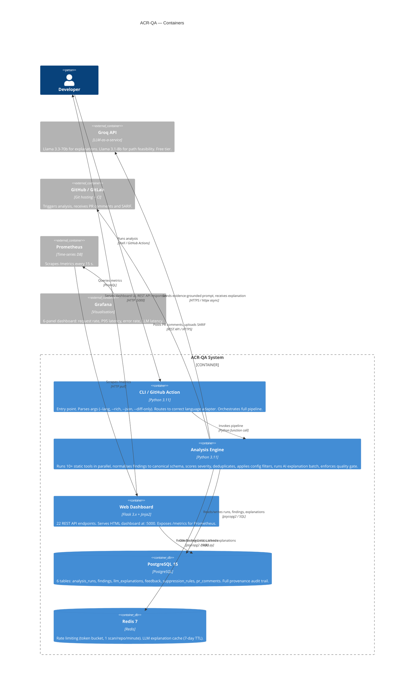

# C2 — Container Diagram

> Level 2 of the C4 model. Shows the deployable units inside ACR-QA and how they communicate.

## Container responsibilities

| Container | Responsibilities | Key files |
|---|---|---|
| **CLI / GitHub Action** | Argument parsing, language detection, entry point | `CORE/main.py` |
| **Analysis Engine** | Tool orchestration, normalisation, scoring, dedup, AI, quality gate | `CORE/engines/`, `CORE/adapters/` |
| **Web Dashboard** | REST API, HTML UI, /metrics endpoint | `FRONTEND/app.py`, `FRONTEND/templates/` |
| **PostgreSQL** | Provenance, findings history, feedback, suppression rules | `DATABASE/schema.sql`, `DATABASE/database.py` |
| **Redis** | Rate limiting, explanation cache | `CORE/utils/rate_limiter.py` |

## Port map

| Service | Port | Notes |
|---|---|---|
| Dashboard / API | 5000 | HTTP — local/internal only (no auth by design for thesis scope) |
| PostgreSQL | 5433 | Mapped from container's 5432 to avoid host conflict |
| Redis | 6379 | Default, no AUTH in dev |
| Prometheus | 9090 | Scrape target |
| Grafana | 3000 | admin/admin in dev |
