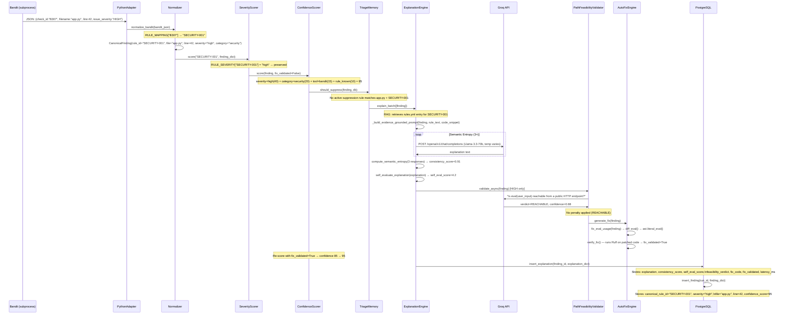

# C4 — Code Diagram: Single Finding Lifecycle

> Level 4 of the C4 model. Traces one finding from raw tool output to PostgreSQL storage.
> Example: Bandit detects `eval(user_input)` in `app.py:42`.



## Key data transformations

```
Raw Bandit JSON
  { "check_id": "B307",
    "filename": "/tmp/repo/app.py",
    "line_number": 42,
    "issue_severity": "HIGH",
    "issue_text": "Use of possibly insecure function - consider using safer alternatives" }

         ↓  normalize_bandit()  ↓

CanonicalFinding (Pydantic model)
  { "canonical_rule_id": "SECURITY-001",
    "file": "app.py",               ← cleaned path (not /tmp/repo/...)
    "line": 42,                     ← integer, not string
    "severity": "high",             ← lowercase, validated enum
    "category": "security",
    "message": "Use of eval() — arbitrary code execution risk (CWE-78)",
    "tool": "bandit",
    "raw_rule_id": "B307",
    "confidence_score": 95,
    "language": "python" }

         ↓  ExplanationEngine  ↓

Explanation record (PostgreSQL llm_explanations)
  { "explanation": "eval() executes arbitrary Python...",
    "consistency_score": 0.91,      ← semantic entropy across 3 LLM runs
    "self_eval_score": 4.2,         ← LLM self-rates on 1-5 scale
    "feasibility_verdict": "REACHABLE",
    "feasibility_confidence": 0.88,
    "fix_code": "value = ast.literal_eval(user_input)",
    "fix_validated": true,
    "latency_ms": 847 }
```

## Deduplication logic

When Semgrep also flags the same `eval()` at `app.py:42`:

```python
key = (finding.file, finding.line, finding.column, finding.canonical_rule_id)
# → ("app.py", 42, 15, "SECURITY-001")

# Bandit and Semgrep both produce this key.
# Tool priority: Bandit (security=3) > Semgrep (security=3) — tie → first seen wins.
# Semgrep duplicate is dropped.
```

## Performance characteristics (measured, v3.2.4)

| Stage | Typical latency | Notes |
|---|---|---|
| Tool execution (parallel) | 2–8 s | Depends on repo size |
| Normalisation | < 100 ms | Pure Python dict lookups |
| Severity scoring | < 50 ms | Dict lookups |
| AI explanation (per finding) | 300–900 ms | Groq Llama 3.3-70b |
| Semantic entropy (3× calls) | +600–1800 ms | Only for top findings |
| Path feasibility | +200–500 ms | Only for HIGH severity |
| DB insert (per finding) | < 10 ms | psycopg2 with connection reuse |
